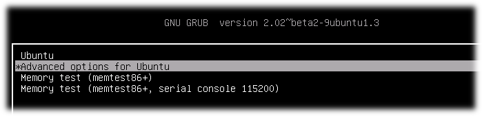
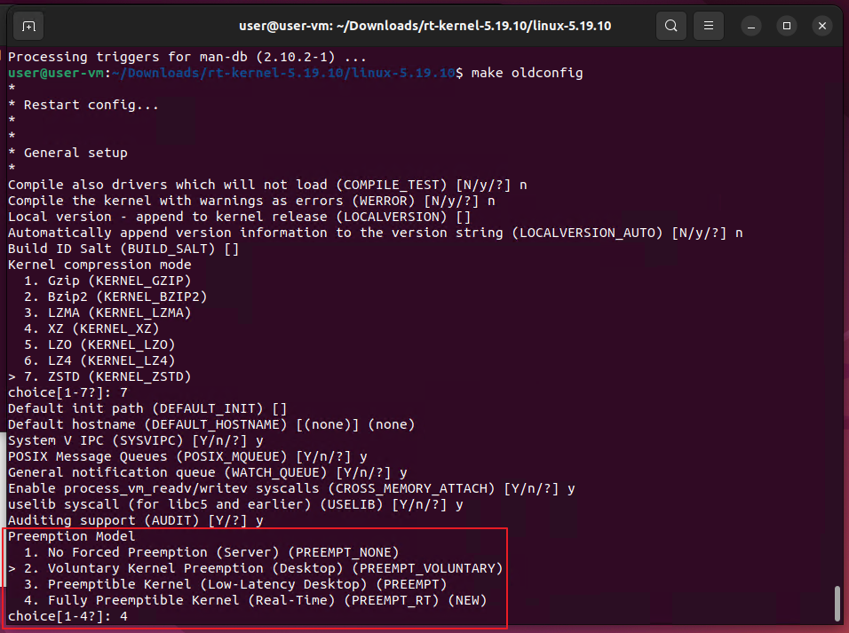
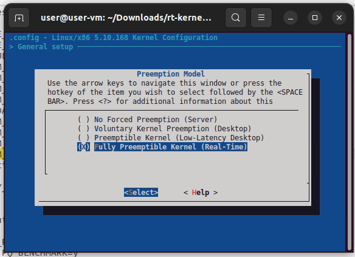
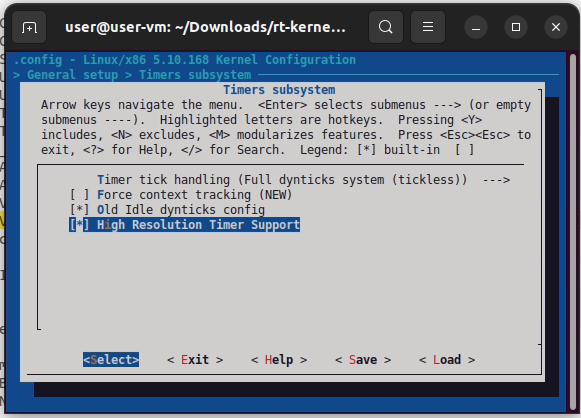
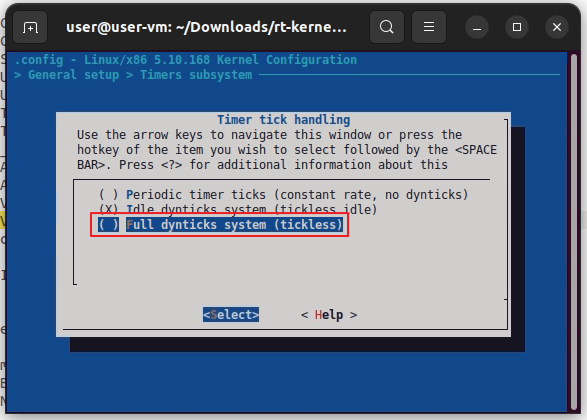
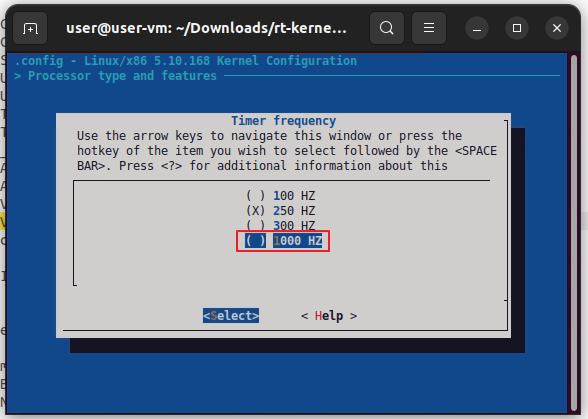
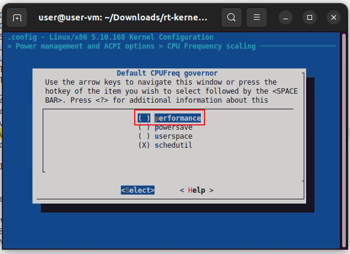

# Readme

This repository is used by me to store compiled Ubuntu 22.04 real-time (PREEMPT_RT) kernels that have been successfully compiled. It was created using a real-time patch downloaded from [RT Project](https://www.kernel.org/pub/linux/kernel/projects/rt/) And while the kernel source was downloaded from [kernel.org](https://www.kernel.org/pub/linux/kernel), Compiling the kernel is a time-consuming task, and I hope that others don't have to spend their time doing it again.


這個版本庫我用來放一些編譯成功的 Ubuntu 22.04 實時 (PREEMPT_RT) 核心。它是使用從 [RT Project](https://www.kernel.org/pub/linux/kernel/projects/rt/) 下載的patch創建的。而核心源代碼是從 [kernel.org](https://www.kernel.org/pub/linux/kernel) 下載的。編譯kernel實在是有夠久的，希望其他人不用再花時間做一遍...


## Update

### 5.10

https://www.kernel.org/pub/linux/kernel/v5.x/

https://www.kernel.org/pub/linux/kernel/projects/rt/5.10/

| version                                                      | release    | compile    |
| ------------------------------------------------------------ | ---------- | ---------- |
| [5.10.168-rt83](https://github.com/HowardWhile/Ubunutu22.04-RT-Kernel/releases/tag/5.10.168-rt83) | 2023-02-19 | 2023-02-23 |
| -                                                            |            |            |
|                                                              |            |            |


### 5.15

https://www.kernel.org/pub/linux/kernel/v5.x/

https://www.kernel.org/pub/linux/kernel/projects/rt/5.15/

| version                                                      | release    | compile    |
| ------------------------------------------------------------ | ---------- | ---------- |
| [5.15.107-rt62](https://github.com/HowardWhile/Ubunutu22.04-RT-Kernel/releases/tag/5.15.107-rt62) | 2023-04-19 | 2023-04-25 |
| [5.15.96-rt61](https://github.com/HowardWhile/Ubunutu22.04-RT-Kernel/releases/tag/5.15.96-rt61) | 2023-02-28 | 2023-03-01 |
| [5.15.94-rt59](https://github.com/HowardWhile/Ubunutu22.04-RT-Kernel/releases/tag/5.15.94-rt59) | 2023-02-17 | 2023-02-23 |
|                                                              |            |            |


## Install

First, download the kernel installation files (*.deb). A kernel version includes the following three files:

1. `linux-image.*.deb`
2. `linux-headers.*.deb`
3. `linux-libc-dev.*.deb`

install by `dpkg`

```shell
sudo dpkg -i *.deb
```

reboot

After the BIOS starts up, you can press 'ESC' to access the GRUB boot loader, where you can select the desired kernel version.



If you accidentally enter the GRUB command line by pressing ESC too many times, you can type "normal" and press Enter, then press ESC a few more times to return to the screen above.


## Real-Time Config

```she
make oldconfig
```




```shell
make menuconfig
```

```shell
# Enable CONFIG_PREEMPT_RT
 -> General Setup
  -> Preemption Model (Fully Preemptible Kernel (Real-Time))
   (X) Fully Preemptible Kernel (Real-Time)
```




```shell
# Enable CONFIG_HIGH_RES_TIMERS
 -> General setup
  -> Timers subsystem
   [*] High Resolution Timer Support
```




```shell
# Enable CONFIG_NO_HZ_FULL
 -> General setup
  -> Timers subsystem
   -> Timer tick handling (Full dynticks system (tickless))
    (X) Full dynticks system (tickless)
```




```shell
# Set CONFIG_HZ_1000 (note: this is no longer in the General Setup menu, go back twice)
 -> Processor type and features
  -> Timer frequency (1000 HZ)
   (X) 1000 HZ
```




```shell
# Set CPU_FREQ_DEFAULT_GOV_PERFORMANCE [=y]
 ->  Power management and ACPI options
  -> CPU Frequency scaling
   -> Default CPUFreq governor
     (X) performance
```




```shell
make -j$(nproc) bindeb-pkg
```
